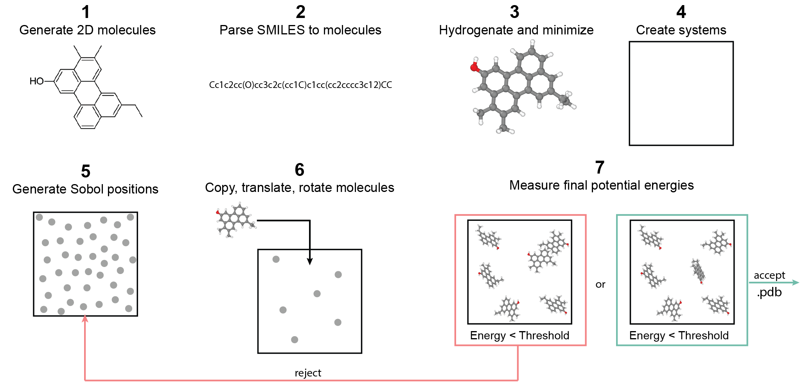
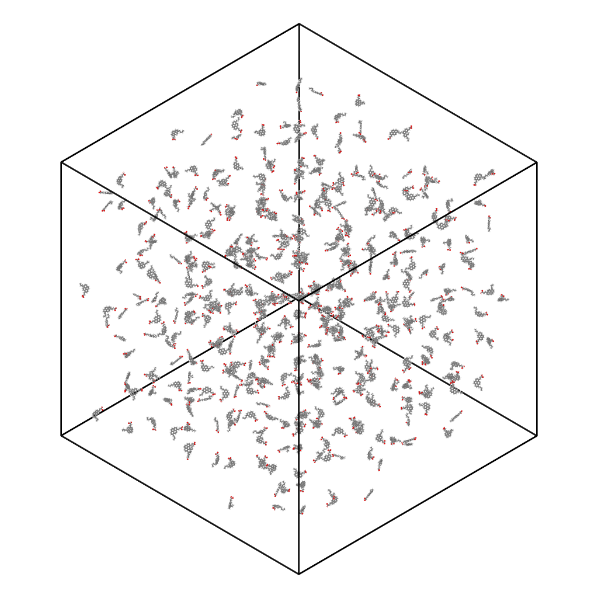
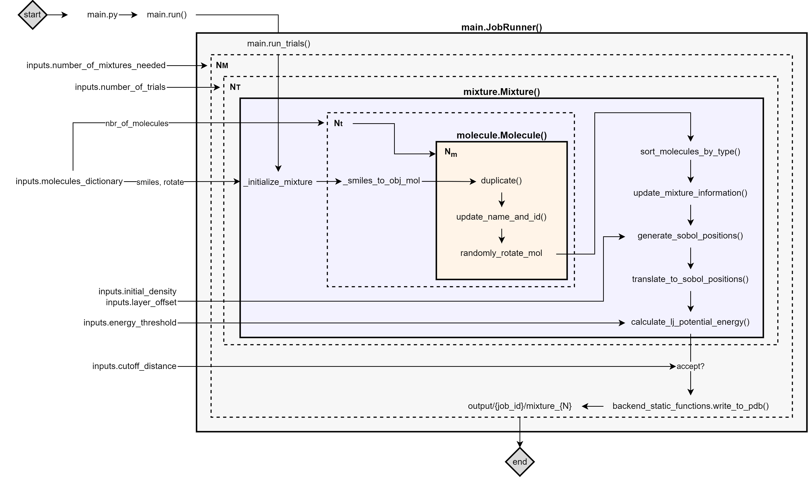
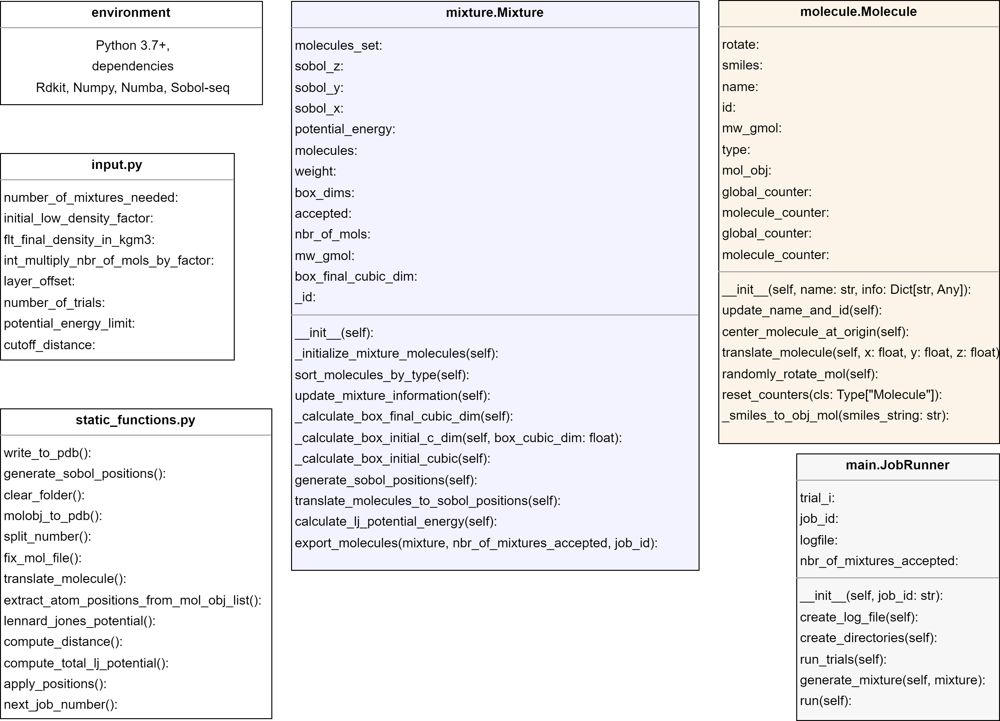

# Smi2Pdb

Computational techniques, notably atomistic simulations, have reduced reliance on physical experiments across scientific
domains. However, the complexity of setting up simulations using platforms like LAMMPS and GROMACS remains. SMI2PDB, a
Python tool, automates molecular systems assembly from SMILES to PDB format, simplifying molecular dynamics simulation
setups by managing molecule configuration, establishing stable conformers, applying random rotations, and positioning
them in a simulation box using a Sobol sequence to mitigate overlaps, thereby expediting the preparation of intricate
organic mixtures for enhanced material exploration.


## Quick Start

Upon successfully installing [Numpy](https://numpy.org/),
[Numba](https://numba.pydata.org/), [Rdkit](https://www.rdkit.org/), and
[Sobol-seq](https://pypi.org/project/sobol-seq/), you are ready to run
your first simulation with SMI2PDB. Follow the steps below to get
started:

1. **Run the Command**: Execute the following command in your terminal
   or command prompt:

   ``` bash
   python smi2pdb.py
   ```
   Note: The capsule in [Code Ocean](https://site.codeocean.com/) is preconfigured to be executable as-is. Simply
   run `smi2pdb.py`.
2.
`smi2pdb.py` initiates the SMI2PDB application, utilizing the
parameters specified in the `inputs.py` file.

2. **About the \`inputs.py\` File**: The default `inputs.py` file is
   configured to initialize a system comprising 500 phenolic
   asphaltene molecules. You can modify this file to change the
   simulation parameters according to your requirements.

3. **Locating the Output**: After the program completes its execution,
   the output will be saved in a structured directory format. Find the
   generated molecular structure file at:

   ``` none
   {output_dir}/1/mixture_1/mixture_1.pdb
   ```
   Note: The `output_dir` directory can be changed in the `inputs.py` file. For execution in CodeOcean, `output_dir`
   should be set to `../results/output`.

4. **Visualizing the Output** The resulting PDB file contains the molecular configuration of the generated
   system, which can be visualized using molecular visualization
   software like [OVITO](https://www.ovito.org/),
   [VMD](https://www.ks.uiuc.edu/Research/vmd/),
   [PyMOL](https://pymol.org/), or [Materials
   Studio](https://www.3ds.com/products/biovia/materials-studio).

## Usage

The user can interact with the `inputs.py` file to change the nature of
the molecular system required. The initial `inputs.py` file provided is
very simple but contains all the tunable parameters needed to produce
molecular systems.

### Sample `inputs.py` File

The sample `inputs.py` file looks like:

``` python
# Input parameters:
output_dir = f"output/"
mixtures_needed = 1
density = 10.0
layer_offset = 25.0
number_of_trials = 500
energy_threshold = 0.0
cutoff_distance = 10.0

# Molecules Dictionary:
molecules_dictionary = {
    "random_compound1": {
        "nbr_of_mols": 500,
        "smiles": "[H]OC([H])(O[H])C([H])([H])C([H])([H])c1c([H])c([H])c2c([H])c([H])c3c4c2c1C([H])([H])C([H])=C4C(C([H])([H])C([H])([H])C([H])([H])C([H])([H])[H])=C([H])C3([H])[H]",
        "rotate": True,
    }
}

# Constants and Unit Conversions:
AVOGADRO_NUMBER = 6.022e23
```

The sample `inputs.py` produces a system that looks like this (rendered using OVITO):



### Obtaining SMILES notations

The simplified molecular-input line-entry system (SMILES) notation for
organic molecules can be obtained from data banks or Chemistry-oriented
software, like
[ChemDraw](https://revvitysignals.com/products/research/chemdraw) or
[ChemSketch](https://www.acdlabs.com/resources/free-chemistry-software-apps/chemsketch-freeware/).
Some examples are provided in the table below.

| Common Name   | SMILES Notation |
|:--------------|:---------------:|
| Acetic acid   |     CC(=O)O     |
| Aniline       |    Nc1ccccc1    |
| Ethyl acetate |    CC(=O)OCC    |
| Phenol        |    c1ccccc1O    |
| Pyridine      |    n1ccccc1     |
| Benzaldehyde  |  c1ccc(cc1)C=O  |
| Acetonitrile  |      CC#N       |
| Cyclohexanol  |    C1CCCCC1O    |

### Input Parameters

The type, description, and typical range values for the input parameters
in the `inputs.py` file are presented in the following table:

| Parameter                 | Type                          | Description                                                                                                                                  | Typical Range                  |
|---------------------------|-------------------------------|----------------------------------------------------------------------------------------------------------------------------------------------|--------------------------------|
| output_dir                | String                        | Output directory where jobs will be submitted to.                                                                                            | "output/", "..results/output/" |
| number_of_mixtures_needed | Integer                       | Number of independent molecular systems required (unitless)                                                                                  | 1 to 10                        |
| initial_density           | Float                         | Density of the simulation box to place the molecules into (Kg/m^3)                                                                           | 1.00 to 400                    |
| layer_offset              | Float                         | Distance (from the boundaries) to confine the molecules into (Angstroms)                                                                     | 0.0 to 50                      |
| energy_threshold          | Float                         | Lennard-Jones interatomic potential energy limit for a mixture to be accepted or rejected (LJ units)                                         | -5.0 to 5.0                    |
| molecules_dictionary      | Dictionary [Dictionaries,...] | Dictionary whose keys are the name of the molecules, and its items are subdictionaries with keys: "smiles", "nbr_of_molecules", and "rotate" |                                |
| nbr_of_trials             | Integer                       | Number of iterations beyond which the program stops trying to place molecules without being rejected                                         | 100-10000                      |

The program can be called multiple times from different commands, in
parallel or in series, as the output for each job submitted is created
by creating a subdirectory in the `output/` folder.

### A customized `inputs.py`

``` python
# Input parameters:
number_of_mixtures_needed = 1
density = 1.0
layer_offset = 25.0
number_of_trials = 500
energy_threshold = 0.0
cutoff_distance = 10.0

# Molecules Dictionary:
molecules_dictionary = {
    "phenol": {
        "nbr_of_mols": 150,
        "smiles": "CC(C)Cc1cc2c3c(cc4c(CC(CC4CC)CCCC)c3c1)c1cc(O)cc3c1c2cc(CCC)c3CCC(C)C",
        "rotate": True,
    },
    "pyrrole": {
        "nbr_of_mols": 100,
        "smiles": "CC(CCc1cc2c(cc1CCC)c1c3c4c5c6c(c7cc[NH]c7cc61)c(cc5c(c1CC(CC)c5cc(CCC(C)C)c6CCc2c3c6c5c41)C(C)CCC)CCCCCC(C)CC)CC",
        "rotate": True,
    },
    "thiophene": {
        "nbr_of_mols": 200,
        "smiles": "Cc1cc(CCC(C)CCC)c2CC(CCC)c3cc4sc5c6c4c4c3c2c1cc4c1cc2c(CC(CC2CC)CCCC)c(cc5CC(C)C)c61",
        "rotate": True,
    },
}

# Constants and Unit Conversions:
AVOGADRO_NUMBER = 6.022e23
```

### Energy threshold and interatomic distance

The distance between two atoms is given by the relationship between the
potential energy threshold ($E$) and their interatomic distance:

$$E = 4\varepsilon \left[ \left(\frac{\sigma}{r}\right)^{12} - \left(\frac{\sigma}{r}\right)^6 \right]$$

where:

- $E$ is the potential energy between two atoms,
- $\varepsilon$ represents the depth of the potential well,
- $\sigma$ is the distance at which the interatomic potential is zero,
- $r$ is the distance between the atoms.

Given $E$, along with $\sigma = 1$ and $\varepsilon = 1$, $r$ is given
by:

$$r = \left(\frac{1 + \sqrt{1 + 4\frac{E}{4}}}{2}\right)^{-\frac{1}{6}}$$

Or more compactly:

$$r = \left(\frac{1 + \sqrt{1 + E}}{2}\right)^{-\frac{1}{6}}$$

The average distance between atoms in the system is guaranteed to be
equal or less than $r$. Maintaining a balance between density and energy
threshold is crucial. If the specified density is too high, it increases
the potential energy, making it more difficult for the program to reach
the desired energy threshold.

## Architecture

The script is initially implemented in Python 3.12 and is reliant on libraries
[Numpy](https://numpy.org/), [Numba](https://numba.pydata.org/),
[Rdkit](https://www.rdkit.org/), and
[Sobol-seq](https://pypi.org/project/sobol-seq/). It comprises seven
primary components: `output/`, `static_functions.py`, `inputs.py`,
`log_functions.py`, `smi2pdb.py`, `mixture.py`, and `molecule.py`.
Auxiliary modules `log_functions.py` and `static_functions.py` are
called upon for their utility functions, including logging, file I/O,
and generic computations.

The script starts with `smi2pdb.py`, initiating a `JobRunner()` instance
that manages job execution and output storage in the directory
`output/{job_id}`. It proceeds by interpreting `inputs.py` to
instantiate a `Mixture()` from `mixture.py`, encapsulating global
attributes of the mixture such as molecule types, spatial coordinates,
and other relevant properties. This `Mixture()` then generates
`Molecule()` instances, each representing a singular molecule\'s objects
that include their SMILES string, 3D conformations, and relevant methods
to alter them as needed (e.g., randomly rotate it).

Upon populating the `Mixture.molecules` array, the system\'s molecular
positions are determined, translated, and the potential energy
evaluated. Conforming mixtures are saved as PDB files in
`{output_dir}/{job_id}/Mixture_[id]`. This iterative process is repeated by
`JobRunner()` until the requisite number of mixtures is synthesized.



A comprehensive list of all the Classes, Methods, Functions, Instances,
Variables, and Requirements in SMI2PDB is seen next.



## License

SMI2PDB is licensed under the GNU General Public License (GPL), which is
a widely used free software license that guarantees end users the
freedom to run, study, share, and modify the software.
The GPL license aims to ensure that the software remains free and
open-source for all its users. For detailed terms and conditions, please
refer to the full license text.
The full text of the GPL license can be found at the official GNU
website or included directly within this documentation.

For the full GPL license text, you may visit the [GNU General Public
License v3.0](https://www.gnu.org/licenses/gpl-3.0.html) website.

If you are using this script for your research, please cite **SMI2PDB: A self-contained Python tool to generate
atomistic systems of organic molecules using their SMILES notations**.

## Credits

The script was created by Eli I. Assaf (e.i.assaf@tudelft.nl), Xueyan Liu, Peng Lin, and Sandra Erkens, all affiliated
at [TU Delft](https://www.tudelft.nl/).
The incentive of producing such script was to normalize the use of Python-based tools to perform MD simulations with
relative ease.

This script is created under the research program Knowledge-based
Pavement Engineering (KPE). KPE is a cooperation between
[Rijkswaterstaat](https://www.rijkswaterstaat.nl/),
[TNO](https://www.tno.nl/nl/), and [TU Delft](https://www.tudelft.nl/)
in which scientific and applied knowledge is gained about asphalt
pavements and which contributes to the aim of Rijkswaterstaat to be
completely climate neutral and to work according to the circular
principle by 2030. The opinions expressed in these papers are solely
from the authors.
